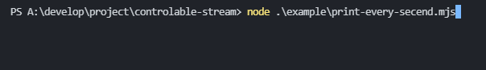
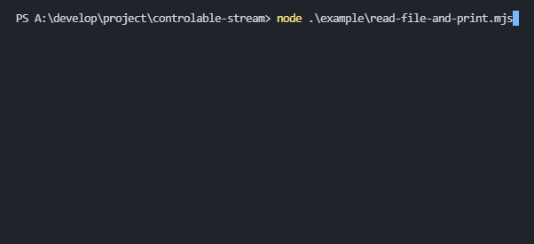
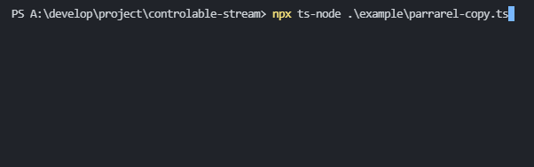

# controlable-stream

Controlable Stream for NodeJS  
It is created by extending the transform stream.

## What controllable-stream can do

- It is possible to measure the speed of the readable stream
- Speed of writable stream can be adjusted
- The strictness of the speed limit can be adjusted

## Installation

```shell
npm i controlable-stream
```

## Usage example

### - Base

```js
import { ControlableStream } from 'controlable-stream'

readableStream
  .pipe(new ControlableStream(100, 10)) 
    // 100 - 100byte/sec
    // 10 - Transmits 10 times per second
  .pipe(writableStream)
```

### - Print every second

  
[print-every-second.mjs](example/print-every-secend.mjs)

```js
import { Readable } from 'stream'
import { ControlableStream } from 'controlable-stream'

Readable.from('abcdefghijk').pipe(new ControlableStream(1, 1)).pipe(process.stdout)
// a.. b.. c.. d.. ..... k
```

### - Read file and print

  
[test.txt](example/test.txt)

```txt
abcdefghijklmnop
```

[read-file-and-print.mjs](example/read-file-and-print.mjs)

```js
import { ControlableStream } from "controlable-stream";
import { createReadStream } from "fs";

const cstream = new ControlableStream(2, 1)
cstream.setOnAddHistory((speed) => console.log(` ${speed}byte/sec`))

createReadStream('./example/test.txt').pipe(cstream).pipe(process.stdout)

// 2byte/sec
// ab 2byte/sec
// cd 2byte/sec
// ef 2byte/sec
// gh 2byte/sec
// ij 2byte/sec
// kl 2byte/sec
// mn 2byte/sec
// op
```

### - parrarel copy

  
[parrarel-copy](example/parrarel-copy.ts)

```ts
import { constants } from 'fs';
import { access, stat } from 'fs/promises';
import { createReadStream, createWriteStream } from 'fs';
import { finished } from 'stream/promises';
import { ControlableStream } from 'controlable-stream';
import task from 'tasuku';

function getFileStat(filePath: string) {
  return access(filePath, constants.F_OK | constants.R_OK)
    .then(() => stat(filePath))
    .catch(() => null);
}

export function copy(filePath: string, destPath: string) {
  const taskTitle = `copy ${filePath} -> ${destPath}`;
  let percentage = 0;

  return task(
    `${taskTitle} start`,
    async ({ setTitle, setStatus, setError }) => {
      setTitle(`${taskTitle} progress`);

      const fileStat = await getFileStat(filePath);
      if (fileStat === null) {
        return setError(`not accessable file = ${filePath}`);
      }

      const rStream = createReadStream(filePath);
      const cStream = new ControlableStream(Infinity, 100); // no limit
      const wStream = createWriteStream(destPath);

      setStatus(`read ${percentage}%`);

      cStream.setOnAddHistory((speed, historys) => {
        const h = historys.at(-1);

        const nowPercentage = Math.floor(
          (cStream.getTotalByte() / fileStat.size) * 100
        );

        if (percentage !== nowPercentage) {
          percentage = nowPercentage;
          setStatus(`read ${percentage}%, ${speed}byte/s`);
        }
      });

      rStream.pipe(cStream).pipe(wStream);

      await finished(wStream).then(() => {
        setTitle(`${taskTitle} finish`);
      });
    }
  );
}

copy(`A:\\test.mp4`, `A:\\test2.mp4`);
copy(`A:\\test.mp4`, `A:\\test3.mp4`);
copy(`A:\\test.mp4`, `A:\\test4.mp4`);
copy(`A:\\test.mp4`, `A:\\test5.mp4`);
copy(`A:\\test.mp4`, `A:\\test6.mp4`);
copy(`A:\\test.mp4`, `A:\\test7.mp4`);
```

## API

### Initialize the ControlableStream

```js
const cStream = new ControlableStream(bytePerSec, numOfSendPerSec, limitStrict, transformOption)`
```

#### Contructor Arguments

- bytePerSec: (0 ~ infinity)
- numOfSendPerSec: (0 < numOfSendPerSec < 1000), (numOfSendPerSec < bytePerSec)
- limitStrict: 0(never) | 1(seldom) | 2(rarely)
- transformOption: TransformOptions

### `ControlableStream.setOnSpeedChange(fn: OnSpeedChange | null): void`

Execute OnSpeedChange function whenever speed changes

```js
ControlableStream.setOnSpeedChange(fn)
```

### `ControlableStream.setOnAddHistory(fn: onAddHistory | null): void`

Executes onAddHistory function whenever a value is sent to the writable stream

```js
ControlableStream.setOnAddHistory(fn: onAddHistory)
```

### `ControlableStream.setBytePerSec(bytePerSec: number): void`

```js
ControlableStream.setBytePerSec(1000)
```

### `ControlableStream.setNumOfSendPerSec(numOfSendPerSec: number): void`

```js
ControlableStream.setNumOfSendPerSec(100)
```

### `ControlableStream.setLimitStrict(limitStrict: 0 | 1 | 2): void`

```js
ControlableStream.setLimitStrict(2)
```

### `ControlableStream.calcByteForSend(): number`

Calculate the number of bytes that can be transmitted at one time

```js
ControlableStream.calcByteForSend()
```

### `ControlableStream.calcTimeToSpend(length: number): number`

Waiting time after sending to the writable stream at the currently limited speed

```js
ControlableStream.calcTimeToSpend(buf.length)
```

### `ControlableStream.getSpeed(): number`

get last speed

```js
ControlableStream.getSpeed()
```

### `ControlableStream.getTotalByte(): number`

total bytes read

```js
ControlableStream.getTotalByte()
```

## License

MIT. Copyright (c) [bishil06](https://github.com/bishil06)